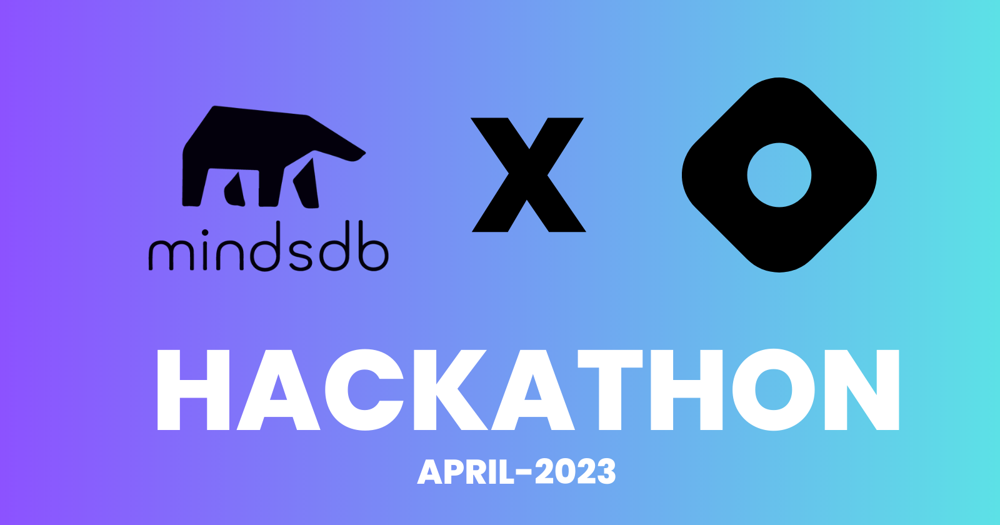

# MindsDB Hackathon (MindsDB X Hashnode) — April 2023
  
  

### Project Task

**To Build an exciting Open-Source app of your choice using MindsDB Machine Learning Powered AI Tables and Datbases its other features during the whole of April. Publish an article on your Hashnode blog about the process of creating and launching your app for a chance to win $5000 Cash prize!**

[Live Demo URL](https://feedbackhive.vercel.app)


#### Dark Mode Theme


#### Light Mode Theme


### Project Overview

It consits of :

* Header
* Login Page
* Sign Up Page
* Hero Section
* Product Feedback Form Page
* Dashboard Page
* Footer
* Dark Mode & Light Mode Functionality

and many more components...

### Tech Stack Used

- Next.js (Fullstack Framework for React.js)
- React.js (Front-end UI Library)
- Tailwind CSS (CSS Framework)
- MindsDB (Cloud Database with AI and Machine Learning Power)
- Supabase (For Database)
- Vercel (For Hosting the App)

### UI Resources Used

* Images - (Google Images)
* SVG Icons - (Hero Icons by Tailwind CSS)
* Fonts (Inter, Manrope & Urbanist)- (Google fonts)


### How to use  Feedback Hive

1. As a person who wants to analyze their customer feedback, visit feedbackhive.in , and sign up using your email and password.

2. After that you will be redirected to the Dashboard page, where you can see all the reviews and their sentiment analysis with a beautiful UI.

3. At starting the dashboard will have some dummy data, you can delete or save them to the positive sentiments tab.

4. Now to collect new feedback, you can share this link https://feedbackhive.in/forms , which contains a product feedback/review form. 

5. Once the user fills out the forms, the data will be saved database and also updated in the dashboard.

6. Now you can see the customer review data with predicted sentiment analysis. 


### The Code

Steps to run the app locally:


#### Step-1: Git Clone the project

```bash
   git clone https://github.com/raiv200/FeedbackHive.git
```

#### Step-2: Install the dependencies

```bash
  npm install
```

#### Step-3: You do need to create MindsDB Account and the train you Models

 1. Go to MindsDB.com and Sign Up.
 2. After that, You can see two options of adding data through files (.csv ,.xlxs) or connect a database.
 3. After you add our data, you have to create a Model and train it with your Data.
 4. Now you can query the Model you created and predict what you want.


#### Step-4: Connecting MidsDB to Frontend.

Here I have used MindsDB Javascript SDK  (mindsdb-js-sdk) , to coonect my front-end to MindsDB.

You can checkout full documentation of this here: [MindsDB JavaScript SDK](https://github.com/mindsdb/mindsdb-js-sdk), you can also use python SDK as well.


#### Step-5: Start the development server

Now open your project in your favorite IDE , (VsCode) and then start the development server.

```bash
   npm run dev
```


